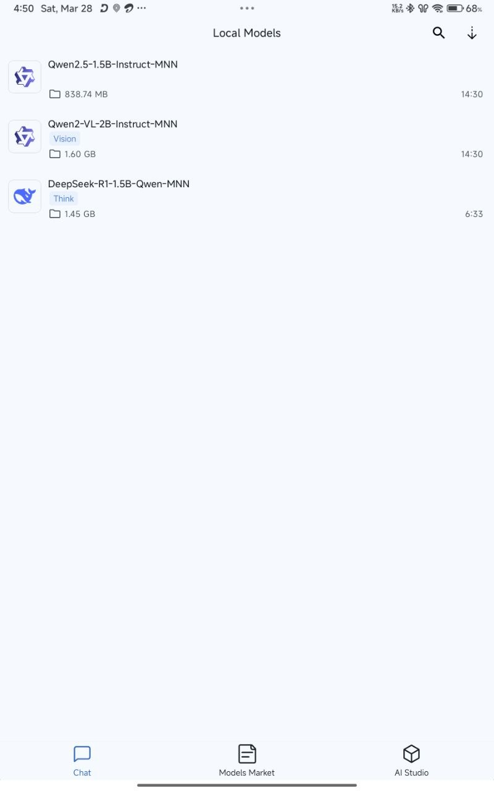
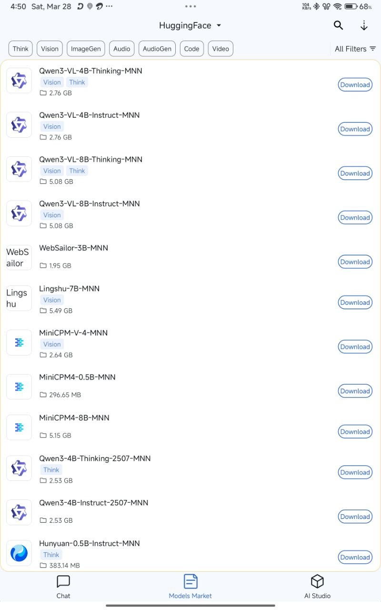
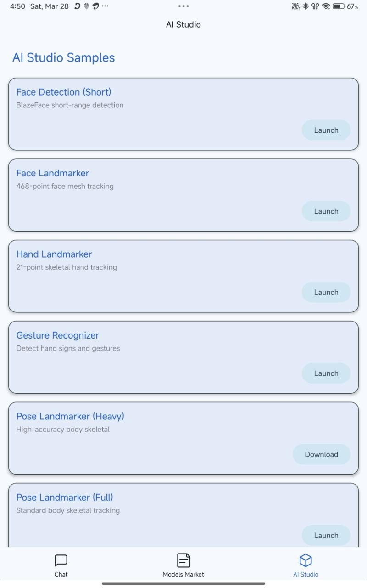
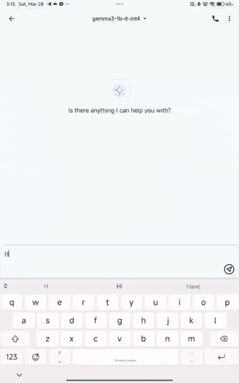
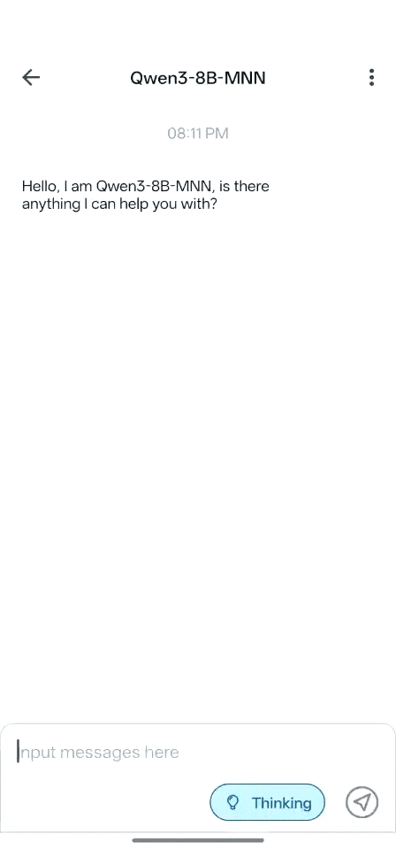
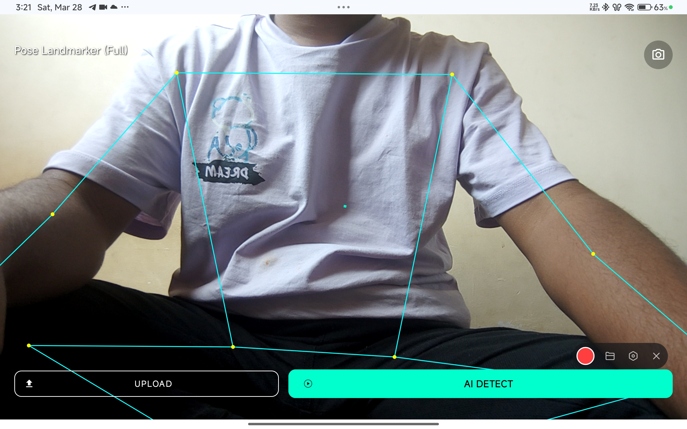
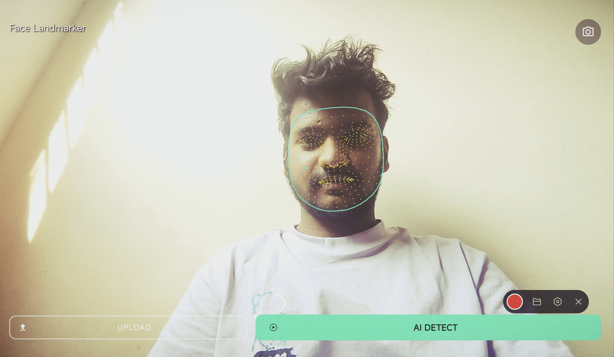

# AuraOnDevice AI Hub 🧠📱

[](https://github.com/rajureddi/AuraOnDevice-AI_HUB)
[](LICENSE)
[](https://developer.android.com/)
[](https://github.com/alibaba/MNN)
[](https://developers.google.com/mediapipe)

---
| HomePage | Model Market |  Ai Studio |
| :---: | :---: |:---: |
|  |  |  |

**AuraOnDevice AI Hub** is a cutting-edge, privacy-first mobile application designed to bring the power of state-of-the-art Large Language Models (LLMs) and Multi-modal AI directly to your Android device. Entirely offline, no APIs, no data leaks.


---

## ✨ Key Features

### 💬 Advanced LLM Chat
- **State-of-the-art Models**: Support for **Gemma 4**, **Gemma 3**, **Qwen**, **DeepSeek**, and more.
- **Advanced Engines**: High-performance inference using **MNN**, **MediaPipe**, and the new **LiteRT-LM (Modern)** engine.
- **Multimodal capabilities**: Interact with text, images, and audio.
- **Fast Inference**: Optimized for mobile NPU/GPU with latest quantization techniques.


### 🎨 AI Studio
A comprehensive suite of on-device AI tools for developers and enthusiasts:
- **Vision**: Face Detection, Hand tracking, Pose estimation, Object detection, and Interactive segmentation.
- **Audio**: Sound classification using YamNet.
- **Text**: Contextual embeddings (BERT), Language detection, and Sentiment analysis.

### 🔒 Privacy First
- **100% Offline**: All processing happens on-device.
- **No Data Harvesting**: Your conversations and data never leave your phone.
- **No API Costs**: Zero reliance on cloud providers like OpenAI or Anthropic.

---

## 📸 Screenshots & Demos

| Gemma 3 (MediaPipe) | Qwen 2.5 (MNN Engine) | |
| :---: | :---: | :---: |
|  |  |

### 🎨 AI Studio Showcase
| Vision Studio (Pose Detection) | Face Studio |  
| :---: | :---: |
|  |  |
Hand and Gesture Detection

https://github.com/user-attachments/assets/77c21d67-6c96-4238-a3af-9809d8c00320

Object Detection 

https://github.com/user-attachments/assets/77cb4ffd-ab2c-4390-a317-33a44f4a5d18


---

## 🛠 Project Structure

- `apps/Android/AuraOnDeviceAi`: The core Android application source code.
- `include/`: Native headers for the MNN engine.
- `source/`: Core engine implementations.
- `transformers/`: Advanced tools for Large Language Model (LLM) conversion, quantization, and optimization.
- `tools/`: Performance profiling and debugging utilities.


---

## 🚀 Getting Started

1. **Clone the Repo**:
   ```bash
   git clone https://github.com/rajureddi/AuraOnDevice-AI_HUB.git
   ```
2. **Open in Android Studio**:
   Navigate to `apps/Android/AuraOnDeviceAi`.
3. **Build & Run**:
   Ensure you have the latest Android NDK installed.

For detailed setup instructions, see the [App README](apps/Android/AuraOnDeviceAi/README.md).

---

## 🤝 Contributing
We welcome contributions! Whether it's optimization, new models, or UI improvements, feel free to open a PR.

## 📄 License
This project is licensed under the MIT License - see the [LICENSE](LICENSE) file for details.

---
Created with ❤️ by [Raju Reddi](https://github.com/rajureddi)
