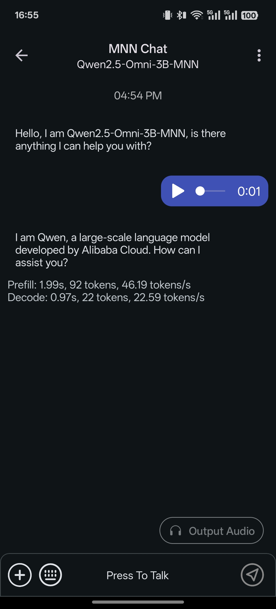

# AuraOnDevice-AI 🤖🎮

AuraOnDevice-AI is a high-performance, features-packed Android application designed for exploring on-device AI capabilities. It integrates top-tier inference engines (MNN, MediaPipe) to deliver a seamless and privacy-first user experience.

---

## 🏗️ Core Components

AuraOnDevice-AI is built around three major pillars:
1. **MNN-LLM Engine**: Alibaba's ultra-fast inference engine for Large Language Models.
2. **MediaPipe LLM Inference**: Google's standardized API for running LLMs like **Gemma 3** on-device.
3. **AI Studio**: A modular toolbox for specialized AI tasks (Vision, Audio, Text).

---

## 🎨 AI Studio: The Ultimate AI Toolbox

The **AI Studio** fragment provides a simplified interface for downloading and launching various specialized models.

| Vision Tasks | Audio Tasks | Text Tasks |
| :--- | :--- | :--- |
| **Face Landmarker**: 468-point mesh | **Audio Classifier**: Sound identification | **Language Detector**: Input ID |
| **Hand Landmarker**: 21-point tracking | **YamNet**: Environmental sound detection | **Text Classifier**: Topic & Sentiment |
| **Pose Landmarker**: Heavy/Full/Lite | | **BERT Embedder**: Contextual analysis |
| **Object Detector**: Real-time detection | | |
| **Interactive Segmenter**: Image clipping | | |

### 🔍 AI Studio Visuals
| Vision Feature | Audio & Sound |
| :---: | :---: |
|  |  |

---

## 💬 LLM Chat Capabilities

Built on top of `MnnLlmChat`, this app expands features for modern mobile hardware.

- **Streaming Inference**: Real-time response generation.
- **Multi-turn conversations**: Context-aware chat sessions.
- **Model Sources**:
  - **Hugging Face**: Integrated model browser for seamless downloading.
  - **Local Storage**: Sideload and use your custom models easily.
- **Multimodal Support**: Future-ready integration for vision-language tasks (LLaVA-MNN).

---

## 🛠️ Technical Details

### Engines Integration
- **MNN**: Leveraging NPU and GPU acceleration for low-latency inference on varying Android hardware.
- **MediaPipe**: Using `LlmInferenceSession` for high-level LLM task management, ensuring stability and performance for Google-optimized models.

### Assets Management
- Built-in downloader for MediaPipe LiteRT (.task) and TFLite models.
- Automatic splitting and management of large model files.

---

## 🚀 Setup & Build

### Prerequisites
- Android Studio Ladybug or newer.
- Android NDK (Version 25.1.8937393 recommended).
- A modern Android device (Snapdragon 8 Gen 1+ or Pixel 6+ for best LLM performance).

### Build steps
1. Clone the repository.
2. Open the project in Android Studio.
3. Run the Gradle sync.
4. Build and install on your device.

---

## 📂 assets/
The `assets` folder contains ready-to-use visualizations and potentially pre-built model configurations. Look out for:
- `compare.gif`: A side-by-side performance analysis.
- `deepseek_support.gif`: Showcasing integration of DeepSeek models.
- `qwen_3.gif`: Demonstrating Qwen 3 capabilities.

---

## 📄 License & Credits
AuraOnDevice-AI is based on the **MnnLlmChat** project by Alibaba and incorporates **MediaPipe** by Google.

**Contributors:**
- [Raju Reddi](https://github.com/rajureddi) (Main Developer)

---
*Elevate your mobile experience with local intelligence.*
